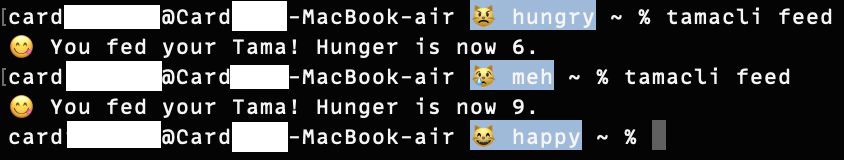

Terminal got lonely? Not anymore! 😼

# TamaCLI 🐣

**TamaCLI** is a terminal-based virtual pet that lives right inside your prompt!  
It's like a Tamagotchi, but it bleps at you every time you run a command. 




## 💻 Features

- Lives in your terminal prompt - no extra steps needed
- Shows your pet's mood in real-time (happy, meh, hungry, or worse!)
- Gets hungrier over time, just like a real pet
- Simple commands to feed, heal, and interact with your pet
- Works seamlessly with your existing terminal workflow

## 🚀 Installation

### Prerequisites

TamaCLI works on **macOS** and **Linux**! 🐧🍏

You'll need:
- Python 3 (standard library only, no extra packages needed)
- `jq` (for handling pet data)

### Install Dependencies

**On macOS:**
```bash
brew install jq python3
```

**On Linux (Debian/Ubuntu):**
```bash
sudo apt-get install jq python3
```

Need help? Check out our guides:
- [How to Install Homebrew](guides/install-homebrew.md) (for macOS users)
- [Manual Installation Guide](guides/manual-install.md) (for other systems)

### Install TamaCLI

1. Clone the repository:
   ```bash
   git clone https://github.com/TamaCLI/TamaCLI-prompt.git
   cd TamaCLI-prompt
   ```

2. Run the installer:
   ```bash
   bash install.sh
   ```

3. Apply changes:
   ```bash
   source ~/.zshrc
   ```

That's it! Your new virtual pet should now be happily bleppin' in your terminal! 😸

## 🎮 Commands

| Command | What it does |
|---------|-------------|
| `tamacli feed` | Feed your pet (+3 hunger, max 10) |
| `tamacli stats` | Show detailed stats about your pet |
| `tamacli doctor` | Heal your pet (+3 health, max 10) |
| `tamacli name <new name>` | Change your pet's name |

### Pet Stats Explained

Your pet has several stats that affect its mood and well-being:

- **Hunger**: 0-10 (10 is full, 0 is starving)
- **Health**: 0-10 (10 is perfect health)
- **Mood**: Changes based on hunger and health levels
  - 😸 happy (hunger ≥ 8)
  - 😿 meh (hunger 4-7)
  - 😾 hungry (hunger < 4)
  - 💀 dead (health ≤ 2)

## 💾 How it Works

- A Python script tracks your pet's stats in `~/.tamacli/state.json`
- A shell function displays your pet's mood right in your prompt
- Hunger increases over time (1 point per minute)
- Health is affected by hunger:
  - Low hunger (≤ 3) decreases health
  - High hunger (≥ 8) slowly restores health
- Regular feeding keeps your pet happy and healthy!

## 🐾 Future Ideas

- Multiple pets/names
- `play` and `sleep` commands
- More interactions and stats
- Downloadable themes with different emojis and moods 🎨
- Settings menu to customize colors and emoji sets ⚙️

## Disclaimer

TamaCLI is an independent project that is not affiliated with, endorsed by, or related to Tamagotchi, Bandai Namco Entertainment, or any of their trademarks or products. This project is purely for fun. Thanks for visiting!
